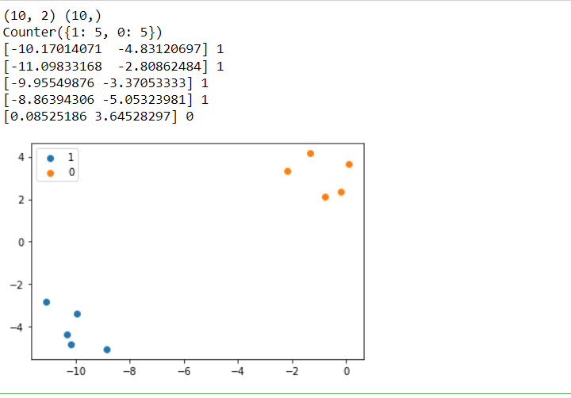

## EX NO: 02

## DATE :

## <p align = 'center'> BINARY CLASSIFICATION</p>
## Aim:
To write a python program to perform binary classification.

## Equipments Required:
1. Hardware – PCs
2. Anaconda – Python 3.7 Installation / Moodle-Code Runner /Google Colab

## related Theory Concept:

Binary classification is a form of classification — the process of predicting categorical variables — where the output is restricted to two classes. It is used in many different data science applications, such as Medical Diagnosis, Email analysis, Marketing, etc. For example, in medical diagnosis, a binary classifier for a specific disease could take in symptoms of a patient and predict whether the patient is healthy or has a disease. The possible outcomes of the diagnosis are positive and negative.

## Algorithm:

Step 1:
Define dataset.

Step 2:
Summarize dataset shape.

Step 3:
Summarize observations by class label.

Step 4:
Summarize first few examples.

Step 5:
Plot the dataset and color the by class label
## Program:
```
Program to implement binary classification.
Developed by: SOUVIK KUNDU
RegisterNumber: 212221230105

from numpy import where
from collections import Counter
from sklearn.datasets import make_blobs
from matplotlib import pyplot
# define dataset--- use the make_blobs() function to generate a synthetic multi-class classification dataset.
X, y = make_blobs(n_samples=10, centers=2, random_state=1)
# summarize dataset shape
print(X.shape, y.shape)
# summarize observations by class label
counter = Counter(y)
print(counter)
# summarize first few examples
for i in range(5):
	print(X[i], y[i])
# plot the dataset and color the by class label
for label, _ in counter.items():
	row_ix = where(y == label)[0]
	pyplot.scatter(X[row_ix, 0], X[row_ix, 1], label=str(label))
pyplot.legend()
pyplot.show()

```
## Output:



## Result:
Thus the python program performed binary classification successfully.
